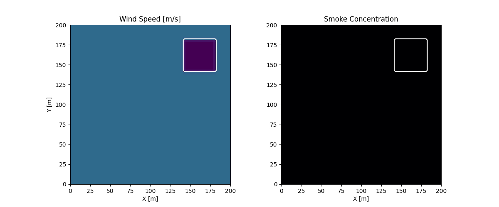

## Introduction

Modern urban planning often inadvertently creates "wind canyons", areas where building geometry accelerates wind, leading to dangerous gusts at the pedestrian level. This project utilizes **Differentiable Physics** to simulate 3D wind flow and pollutant dispersion, providing a tool to optimize building layouts for pedestrian comfort.

## Theory

The air flow is modeled using the 3D Incompressible Navier-Stokes equations:

$$
\rho \left( \frac{\partial \mathbf{u}}{\partial t} + \mathbf{u} \cdot \nabla \mathbf{u} \right) = -\nabla p + \mu \nabla^2 \mathbf{u} + \mathbf{f}
$$
$$
\nabla \cdot \mathbf{u} = 0
$$

Pollutant (e.g., $CO_2$) transport is modeled with the advection-diffusion equation:

$$
\frac{\partial c}{\partial t} + \mathbf{u} \cdot \nabla c = D \nabla^2 c + S
$$

## Numerical Setup

We employ a Cartesian grid, accelerated on Apple Silicon using the PyTorch backend via [PhiFlow](https://github.com/tum-pbs/PhiFlow).

```{python}
#| label: setup
#| echo: false
from phi.torch.flow import *
from src.simulation import setup_simulation, step_simulation
from src.geometry import create_mask
import matplotlib.pyplot as plt

# Simulation parameters
res = (64, 64, 16)
domain_size = (200, 200, 50)
```

## Procedural Geometry

We generate a 3x3 building grid programmatically, allowing for rapid iteration on urban layouts.

```{python}
#| label: geometry
#| fig-cap: "Building obstacle mask (z-slice)"
obstacle_mask = create_mask(domain_size, res, layout_type="grid")
# Visualization of the obstacle layout
plt.imshow(obstacle_mask.values.numpy('x,y,z')[:, :, 2].T, origin='lower')
plt.title("Building Footprints")
plt.show()
```

## Simulation Results

The simulation runs for 50 steps, capturing the wind flow around the buildings and the dispersion of a pollutant source located at the street level.



## Conclusion & Pipeline

The simulation generates data compatible with scientific visualization tools and can be imported into Blender using Geometry Nodes for cinematic rendering. The use of Differentiable Physics allows this framework to be extended into an optimization loop to minimize pedestrian gust zones.
